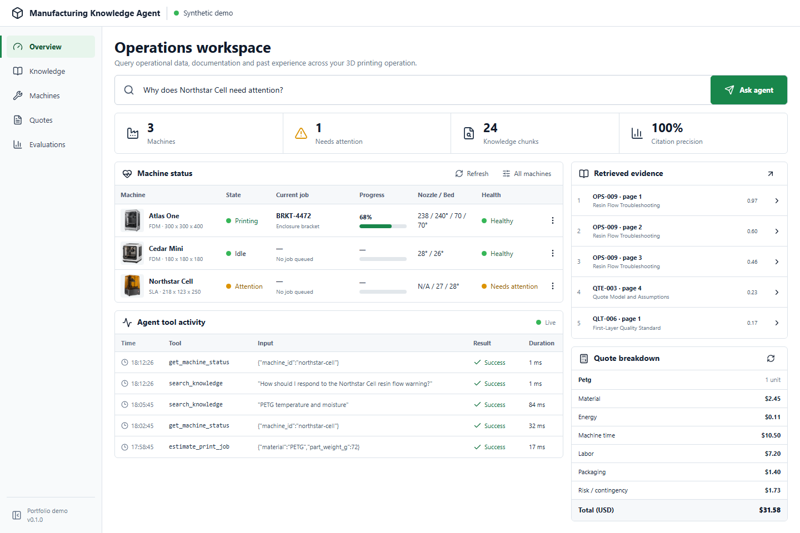
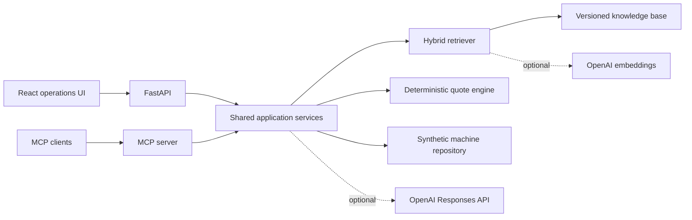
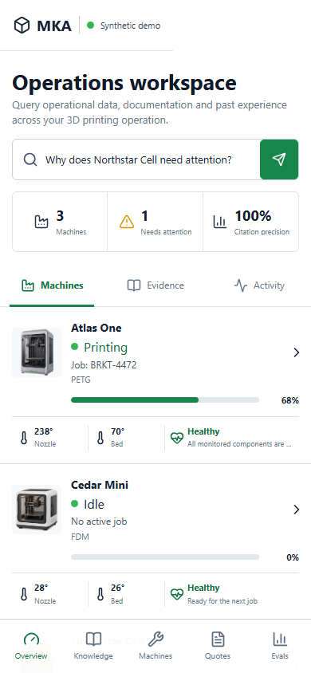

# Manufacturing Knowledge Agent

[](https://github.com/santosgus3dtech/manufacturing-knowledge-agent/actions/workflows/ci.yml)
[](https://www.python.org/)
[](https://modelcontextprotocol.io/)
[](LICENSE)

A portfolio-safe RAG and Model Context Protocol workspace for small manufacturing operations. It combines grounded knowledge search, synthetic machine telemetry, deterministic job quoting and retrieval evaluation behind one FastAPI service and an operational React interface.

> Every machine, job, document and event in this repository is fictional. No customer information, production credentials or live infrastructure details are included.



## What It Demonstrates

- **Grounded RAG:** hybrid lexical retrieval with manufacturing vocabulary expansion, optional OpenAI embeddings and inspectable citations.
- **MCP integration:** typed tools, resources and a reusable incident-triage prompt over the same application services.
- **Reliable business logic:** deterministic `Decimal`-based quoting stays separate from generative output.
- **Evaluation:** a versioned dataset reports Recall@3 and mean reciprocal rank for retrieval changes.
- **Product thinking:** responsive operations UI, machine health, tool traces, evidence inspection and quote controls.
- **Portfolio hygiene:** synthetic fixtures, local fallback mode, secret-safe configuration, tests, CI and Docker support.

## Architecture



The API and MCP surfaces share one service layer, so search results, quotes and machine state remain consistent across clients. With no API key, the project runs entirely in local deterministic mode.

## Quick Start

### Backend

```powershell
python -m venv .venv
.\.venv\Scripts\Activate.ps1
python -m pip install -e ".\backend[dev]"
Copy-Item .env.example .env.local
uvicorn manufacturing_agent.api:app --reload
```

The API is available at `http://127.0.0.1:8000`; interactive documentation is at `/docs`.

### Frontend

```powershell
Set-Location frontend
pnpm install
pnpm run dev
```

Open `http://127.0.0.1:5173`. Vite proxies `/api` requests to FastAPI.

### Docker

```powershell
docker compose up --build
```

The combined application is served at `http://127.0.0.1:8000`.

## MCP Server

Run over stdio:

```powershell
.\.venv\Scripts\python.exe -m manufacturing_agent.mcp_server
```

Available tools:

| Tool | Purpose |
| --- | --- |
| `search_knowledge` | Retrieve ranked, cited operational guidance |
| `get_machine_status` | Read normalized synthetic machine state |
| `estimate_print_job` | Produce a deterministic cost breakdown |
| `diagnose_incident` | Generate a grounded incident assessment |

The server also exposes machine and material resources plus an `incident_triage` prompt. To use Streamable HTTP, set `MKA_MCP_TRANSPORT=streamable-http`; the endpoint listens on port `8001`.

## API Surface

| Method | Endpoint | Description |
| --- | --- | --- |
| `GET` | `/api/dashboard` | Operational and retrieval summary |
| `GET` | `/api/machines` | Synthetic machine inventory |
| `GET` | `/api/knowledge/search` | Ranked knowledge search |
| `POST` | `/api/agent/ask` | Grounded answer with citations |
| `POST` | `/api/quotes/estimate` | Deterministic quote calculation |
| `GET` | `/api/evaluations` | Retrieval evaluation results |
| `GET` | `/api/activity` | Recent tool traces |

## Quality Checks

```powershell
.\.venv\Scripts\ruff.exe check backend
.\.venv\Scripts\pytest.exe backend\tests
pnpm --dir frontend run lint
pnpm --dir frontend run build
```

The committed evaluation set covers maintenance, materials, quality, connectivity and quoting. It is intentionally small and readable so changes can be reviewed in a pull request.

## Project Layout

```text
backend/                 FastAPI, MCP, retrieval, quote engine and tests
data/fixtures/           Synthetic machine state
data/knowledge/          Portfolio-safe manufacturing documents
evals/                   Retrieval evaluation dataset
frontend/                React and TypeScript operations interface
docs/design/             Generated visual direction used during implementation
docs/screenshots/        Verified desktop and mobile application captures
```

## Design Notes

The interface is deliberately closer to an operations console than a marketing page: compact information density, visible evidence, restrained color and clear status semantics. The generated design studies are retained in `docs/design` to show the concept-to-implementation process.



## License

MIT License. See [LICENSE](LICENSE).
